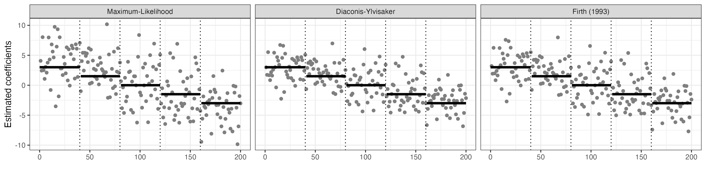
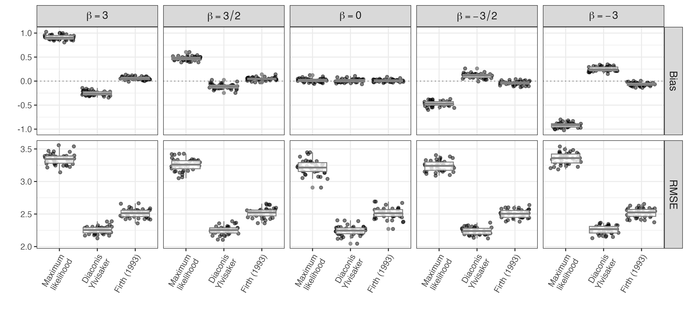

*(This tutorial illustrates main results of the analysis in an
easy-to-read format. Complete code associated with this page is
available in the file*
[simulation-studies.Rmd](https://github.com/tommasorigon/logistic-bias-reduction/blob/main/HIGH-DIMENSIONAL-SYNTHETIC/simulation-studies.Rmd)),

# Simulation studies

The purpose of this study is to investigate the behavior of the proposed
estimator in high dimensional and computationally challenging scenarios,
and compare its performance with standard maximum likelihood and Firth
(1993).

We focus on an example inspired by the Appendix D of Sur and Candès
(2019) and the Supplementary Materials of Kosmidis and Firth (2021),
focusing on a setting with $n=1000$ observations from a logistic
regression model with $p=200$, and coefficients divided in $5$ blocks of
$40$ coefficients with values set as 3, 1.5, 0, -1.5, -3.

``` r
set.seed(1991)
n <- 1000
p <- 200
b0 = c(3,1.5,0, -1.5,-3)
beta = rep(b0,each = p/5)
X <- matrix(rnorm(n * (p), 0, sqrt(1 / n)), n, p)
y <- rbinom(n, 1, plogis(X %*% beta))
fit_mle <- glm(y ~ X - 1, family = binomial("logit"))
```

Recalling that penalized likelihood optimization under the proposed
Diaconis-Ylvisaker conjugate prior induces a binomial likelihood with
pseudo-counts, we can rely on different available optimization methods
for logistic regression models. We found that quasi-Newton methods have
better numerical performance; refer to Nocedal and Wright (2006) for
additional details. A practical implementation for logistic regression
optimization via L-BFGS is provided in the function `fastLR` available
in the package `RcppNumerical`. We compare estimates and elapsed time
for a single estimation. Analysis are conducted on a 2020 Macbook Pro
with M1 processor (`aarch64-apple-darwin20`) running R 4.1.1 linked with
`openblas`. For more details on computational performance refer to the
file
[`compare_timing.r`](https://github.com/tommasorigon/logistic-bias-reduction/blob/main/HIGH-DIMENSIONAL-SYNTHETIC/compare_timing.r),
where we compare the elapsed timing [with and without classical BLAS
libraries](https://github.com/tommasorigon/logistic-bias-reduction/blob/main/HIGH-DIMENSIONAL-SYNTHETIC/compare_timing.r#L25-L47)
via `microbenchmark`, and show the limits of Firth’s correction in a
[large
settings](https://github.com/tommasorigon/logistic-bias-reduction/blob/main/HIGH-DIMENSIONAL-SYNTHETIC/compare_timing.r#L50-L69)
with correlated design matrix.

``` r
library(brglm2)
m <- nrow(X)
y_dy <- p / (p + m) * 0.5 + m / (p + m) * y


library(RcppNumerical)
t0 <- Sys.time()

# DY ESTIMATE
fit_fast_dy <- fastLR(X, y_dy)
t1 <- Sys.time()
elapsed_fast_dy <- t1 - t0

# FIRTH (1993)
t0 <- Sys.time()
fit_firth <- brglm_fit(X,y,
  family = binomial("logit"),
  control = list(type = "AS_mean")
)
t1 <- Sys.time()
elapsed_firth <- t1 - t0
```

The following table and figure compare elapsed time and point estimates,
respectively, for a single replication.

|                          | timing     |
|:-------------------------|:-----------|
| DY - fast implementation | 0.002 secs |
| Firth (1993)             | 0.634 secs |



We evaluate the frequentist properties of different estimators in terms
of bias and RMSE, across 5000 replications of this scenario. Results are
stored in the file `sur-candes.RData` and can be reproduced running the
script
[`sur-candes.R`](https://github.com/tommasorigon/logistic-bias-reduction/blob/main/HIGH-DIMENSIONAL-SYNTHETIC/sur-candes.R)
(takes approximately 4 hours).



### Predictive accuracy

Lastly, we evaluate the predictive performance of the three apporaches
in terms of accuracy, sensitivity and sensibility (using the value $0.5$
as a threshold) and in terms of Area Under the Roc curve (AUC).

``` r
# load results
load("full_sim.RData")
pr_ml = plogis(tcrossprod(X, ml))
pr_dy = plogis(tcrossprod(X, dy))
pr_br = plogis(tcrossprod(X, br))

# Predictive performance
acc_dy = acc_ml = acc_br = numeric(Nsim)
auc_dy = auc_ml = auc_br = numeric(Nsim)
spec_dy = spec_ml = spec_br = numeric(Nsim)
sens_dy = sens_ml = sens_br = numeric(Nsim)

for(it in 1:Nsim){
  acc_ml[it] = 1-ModelMetrics::ce(y_sim[,it], pr_ml[,it] > 0.5)
  acc_dy[it] = 1-ModelMetrics::ce(y_sim[,it], pr_dy[,it] > 0.5)
  acc_br[it] = 1-ModelMetrics::ce(y_sim[,it], pr_br[,it] > 0.5)

  auc_ml[it] = ModelMetrics::auc(y_sim[,it], pr_ml[,it])
  auc_dy[it] = ModelMetrics::auc(y_sim[,it], pr_dy[,it])
  auc_br[it] = ModelMetrics::auc(y_sim[,it], pr_br[,it])

  spec_ml[it] = ModelMetrics::specificity(y_sim[,it], pr_ml[,it])
  spec_dy[it] = ModelMetrics::specificity(y_sim[,it], pr_dy[,it])
  spec_br[it] = ModelMetrics::specificity(y_sim[,it], pr_br[,it])

  sens_ml[it] = ModelMetrics::sensitivity(y_sim[,it], pr_ml[,it])
  sens_dy[it] = ModelMetrics::sensitivity(y_sim[,it], pr_dy[,it])
  sens_br[it] = ModelMetrics::sensitivity(y_sim[,it], pr_br[,it])
}

acc_all = cbind(acc_ml, acc_dy, acc_br)
auc_all = cbind(auc_ml, auc_dy, auc_br)
sens_all = cbind(sens_ml, sens_dy, sens_br)
spec_all = cbind(spec_ml, spec_dy, spec_br)

acc_mean = apply(acc_all,2,mean)*100
acc_sd = apply(acc_all,2,sd)*100

auc_mean = apply(auc_all,2,mean)*100
auc_sd = apply(auc_all,2,sd)*100

spec_mean = apply(spec_all,2,mean)*100
spec_sd = apply(spec_all,2,sd)*100

sens_mean = apply(sens_all,2,mean)*100
sens_sd =apply(sens_all,2,sd)*100

# create table
fm = function(m,s) sprintf("%.2f (%.2f)",m,s)

res = data.frame(cbind(fm(apply(acc_all,2,mean)*100, apply(acc_all,2,sd)*100),
fm(apply(spec_all,2,mean)*100, apply(spec_all,2,sd)*100),
fm(apply(sens_all,2,mean)*100, apply(sens_all,2,sd)*100),
fm(apply(auc_all,2,mean)*100, apply(auc_all,2,sd)*100)))

colnames(res) = c("Accuracy",  "Specificity", "Sensitivity", "AUC")
rownames(res) = c("MLE", "DY", "@Firth1993")
kable(res,type = "markdown")
```

<table>
<thead>
<tr>
<th style="text-align:left;">
</th>
<th style="text-align:left;">
Accuracy
</th>
<th style="text-align:left;">
Specificity
</th>
<th style="text-align:left;">
Sensitivity
</th>
<th style="text-align:left;">
AUC
</th>
</tr>
</thead>
<tbody>
<tr>
<td style="text-align:left;">
MLE
</td>
<td style="text-align:left;">
75.52 (1.37)
</td>
<td style="text-align:left;">
75.62 (1.84)
</td>
<td style="text-align:left;">
75.43 (1.88)
</td>
<td style="text-align:left;">
83.56 (1.27)
</td>
</tr>
<tr>
<td style="text-align:left;">
DY
</td>
<td style="text-align:left;">
75.49 (1.36)
</td>
<td style="text-align:left;">
75.62 (1.83)
</td>
<td style="text-align:left;">
75.36 (1.87)
</td>
<td style="text-align:left;">
83.53 (1.26)
</td>
</tr>
<tr>
<td style="text-align:left;">
Firth (1993)
</td>
<td style="text-align:left;">
75.52 (1.37)
</td>
<td style="text-align:left;">
75.62 (1.84)
</td>
<td style="text-align:left;">
75.43 (1.87)
</td>
<td style="text-align:left;">
83.56 (1.27)
</td>
</tr>
</tbody>
</table>

``` r
#xtable::xtable(res)
```

# References

<div id="refs" class="references csl-bib-body hanging-indent">

<div id="ref-Firth1993" class="csl-entry">

Firth, David. 1993. “<span class="nocase">Bias reduction of maximum
likelihood estimates</span>.” *Biometrika* 80 (1): 27–38.

</div>

<div id="ref-Kosmidis2021" class="csl-entry">

Kosmidis, Ioannis, and David Firth. 2021. “<span
class="nocase">Jeffreys-prior penalty, finiteness and shrinkage in
binomial-response generalized linear models</span>.” *Biometrika* 108
(1): 71–82. <https://doi.org/10.1093/biomet/asaa052>.

</div>

<div id="ref-Nocedal2006" class="csl-entry">

Nocedal, Jorge, and Stephen Wright. 2006. *Conjugate Gradient Methods*.
New York, NY: Springer New York.

</div>

<div id="ref-Sur2019" class="csl-entry">

Sur, P, and E. J. Candès. 2019. “A Modern Maximum-Likelihood Theory for
High-Dimensional Logistic Regression.” *Proc. Nat. Acad. Sci.* 116:
14516–25.

</div>

</div>
