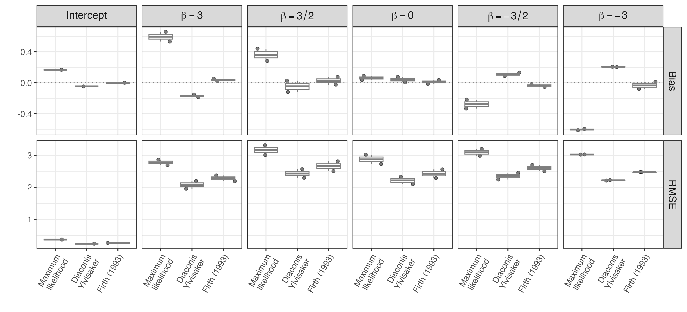

```{r setup, include=FALSE}
library(knitr)
library(ggplot2)
```

# Simulation studies, part 2

This simulation setting emulates [simulation-studies.Rmd](https://github.com/tommasorigon/logistic-bias-reduction/blob/main/HIGH-DIMENSIONAL-SYNTHETIC/simulation-studies.Rmd)), but focuses on unbalanced settings.


```{r,echo=T}
set.seed(1991)
n <- 100
p <- 10
b0 <- c(3, 1.5, 0, -1.5, -3)
beta <- c(3, rep(b0, each = p / 5))
X <- cbind(1, matrix(rnorm(n * (p), 0, sqrt(1 / n)), n, p))
p <- ncol(X)
y <- rbinom(n, 1, plogis(X %*% beta))
fit_mle <- glm(y ~ X - 1, family = binomial("logit"))
```

We evaluate the frequentist properties of different estimators in terms of
bias and RMSE, across 5000 replications of this scenario. Results are
stored in the file `sur-candes-3.RData` and can be reproduced running the
script
[`sur-candes-p2.R`](https://github.com/tommasorigon/logistic-bias-reduction/blob/main/HIGH-DIMENSIONAL-SYNTHETIC/sur-candes-p2.R)

```{r, echo=F,warning=F,message=FALSE,fig.height=3,fig.width=12,fig.align='center'}
rm(list = ls())
load("full_sim-p3.RData")
rmse.beta <- sqrt(mse.beta)
bias.beta$x <- 1:NROW(bias.beta)
rmse.beta$x <- 1:NROW(rmse.beta)
# mae.beta$x = 1:NROW(mae.beta)
df <- reshape2::melt(list("Bias" = bias.beta, "RMSE" = rmse.beta), id.var = "x")
df <- subset(df, variable != "clogg")
df$variable <- factor(df$variable,
  levels = c("ml", "dy", "br"),
  labels = c("Maximum\nlikelihood", "Diaconis\nYlvisaker", "Firth (1993)"), ord = T
)

df$xl <- cut(df$x, breaks = seq(0, p, by = p / 5), labels = paste0("beta==", c("3", "3/2", "0", "-3/2", "-3")))
line_df <- subset(df, L1 == "Bias")
line_df <- do.call(rbind, by(line_df, line_df$xl, head, 1))
line_df$value <- 0
library(ggplot2)
pl <- ggplot(df) +
  geom_jitter(aes(y = value, x = variable, group = variable), alpha = .5) +
  geom_boxplot(aes(y = value, x = variable, group = variable), alpha = .8, color = "gray50") +
  # facet_wrap(~L1 + xl, scales = "free") +
  geom_hline(data = line_df, aes(yintercept = 0), col = "gray50", lty = 3) +
  facet_grid(rows = vars(L1), cols = vars(xl), scales = "free", labeller = label_parsed) +
  theme_bw(base_size = 12) +
  xlab("") +
  ylab("") +
  scale_fill_manual(values = c("black", "grey25", "grey75", "white")) +
  theme(
    legend.position = "none",
    axis.text.x = element_text(angle = 60, hjust = 1, vjust = 1),
    strip.text = element_text(size = 12)
  )
ggsave(pl, file = "figs/boxpl-3.png", width = 11, height = 5)

```

```{r paper-fig,eval=F,echo=F}
# EPS format
pl <- ggplot(df) +
  geom_boxplot(aes(y = value, x = variable, group = variable), color = "gray50") +
  # geom_jitter(aes(y = value, x = variable,  group = variable), alpha = .2, color = "gray") +
  # facet_wrap(~L1 + xl, scales = "free") +
  geom_hline(data = line_df, aes(yintercept = 0), col = "gray50", lty = 3) +
  facet_grid(rows = vars(L1), cols = vars(xl), scales = "free", labeller = label_parsed) +
  theme_bw(base_size = 14) +
  xlab("") +
  ylab("") +
  scale_fill_manual(values = c("black", "grey25", "grey75", "white")) +
  theme(
    legend.position = "none",
    axis.text.x = element_text(angle = 60, hjust = 1, vjust = 1),
    strip.text = element_text(size = 16)
  )
# pl_min = pl + theme_minimal() +
#   theme(legend.position = "none",
#         axis.text.x = element_text(angle = 60,hjust = 1,vjust = 1),
#         strip.text = element_text(size=16)
#         )
ggsave(pl, file = "figs/boxplot-supp.pdf", width = 11, height = 5)
# ggsave(pl, file = "figs/boxplot.eps",  width = 11,height = 5)
```

### Predictive accuracy
Lastly, we evaluate the predictive performance of the three apporaches in terms of accuracy, sensitivity and sensibility (using the value $0.5$ as a threshold) and in terms of Area Under the Roc curve (AUC).
```{r}
# load results
load("full_sim-p2.RData")
pr_ml <- plogis(tcrossprod(X, ml))
pr_dy <- plogis(tcrossprod(X, dy))
pr_br <- plogis(tcrossprod(X, br))

# Predictive performance
acc_dy <- acc_ml <- acc_br <- numeric(Nsim)
auc_dy <- auc_ml <- auc_br <- numeric(Nsim)
spec_dy <- spec_ml <- spec_br <- numeric(Nsim)
sens_dy <- sens_ml <- sens_br <- numeric(Nsim)

for (it in 1:Nsim) {
  acc_ml[it] <- 1 - ModelMetrics::ce(y_sim[, it], pr_ml[, it] > 0.5)
  acc_dy[it] <- 1 - ModelMetrics::ce(y_sim[, it], pr_dy[, it] > 0.5)
  acc_br[it] <- 1 - ModelMetrics::ce(y_sim[, it], pr_br[, it] > 0.5)

  auc_ml[it] <- ModelMetrics::auc(y_sim[, it], pr_ml[, it])
  auc_dy[it] <- ModelMetrics::auc(y_sim[, it], pr_dy[, it])
  auc_br[it] <- ModelMetrics::auc(y_sim[, it], pr_br[, it])

  spec_ml[it] <- ModelMetrics::specificity(y_sim[, it], pr_ml[, it])
  spec_dy[it] <- ModelMetrics::specificity(y_sim[, it], pr_dy[, it])
  spec_br[it] <- ModelMetrics::specificity(y_sim[, it], pr_br[, it])

  sens_ml[it] <- ModelMetrics::sensitivity(y_sim[, it], pr_ml[, it])
  sens_dy[it] <- ModelMetrics::sensitivity(y_sim[, it], pr_dy[, it])
  sens_br[it] <- ModelMetrics::sensitivity(y_sim[, it], pr_br[, it])
}

acc_all <- cbind(acc_ml, acc_dy, acc_br)
auc_all <- cbind(auc_ml, auc_dy, auc_br)
sens_all <- cbind(sens_ml, sens_dy, sens_br)
spec_all <- cbind(spec_ml, spec_dy, spec_br)

acc_mean <- apply(acc_all, 2, mean) * 100
acc_sd <- apply(acc_all, 2, sd) * 100

auc_mean <- apply(auc_all, 2, mean) * 100
auc_sd <- apply(auc_all, 2, sd) * 100

spec_mean <- apply(spec_all, 2, mean) * 100
spec_sd <- apply(spec_all, 2, sd) * 100

sens_mean <- apply(sens_all, 2, mean) * 100
sens_sd <- apply(sens_all, 2, sd) * 100

# create table
fm <- function(m, s) sprintf("%.2f (%.2f)", m, s)

res <- data.frame(cbind(
  fm(apply(acc_all, 2, mean) * 100, apply(acc_all, 2, sd) * 100),
  fm(apply(auc_all, 2, mean) * 100, apply(auc_all, 2, sd) * 100),
  fm(apply(spec_all, 2, mean) * 100, apply(spec_all, 2, sd) * 100),
  fm(apply(sens_all, 2, mean) * 100, apply(sens_all, 2, sd) * 100)
))

colnames(res) <- c("Accuracy", "AUC", "Specificity", "Sensitivity")
rownames(res) <- c("MLE", "DY", "@Firth1993")
kable(res, type = "markdown")
# xtable::xtable(res)
```

# References
