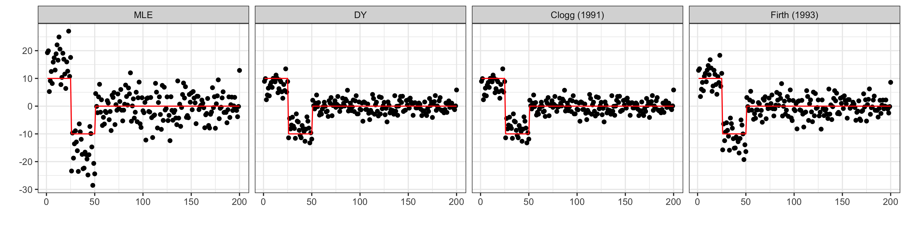
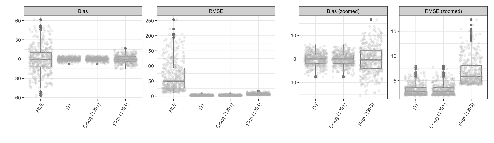

```{r setup, include=FALSE}
library(knitr)
library(ggplot2)
```

# Simulation studies

In this tutorial we focus on different simulation studies to evaluate
the performance of the proposed DY correction against competitors.

## First example
The first example is taken from Appendix D @Sur2019 and the Supplementary Materialds of @Kosmidis2021,
and focuses on a setting with $n=1000$ observations from a logisitc regression model with
$p=200$, $25%$ of coefficients equal to $10$, $25%$ of coefficients equal to $-10$ and the remaining set 
as $0$.

```{r,echo=T}
set.seed(1)
n <- 2000
p <- 400
beta <- c(rep(10, p / 8), rep(-10, p / 8), rep(0, 3 * p / 4))
X <- matrix(rnorm(n * p, 0, sqrt(1 / n)), n, p)
y <- rbinom(n, 1, plogis(X %*% beta))
fit_mle <- glm(y ~ X - 1, family = binomial("logit"))
```


We estimate different corrections and compare their empirical performance in terms of
timing. Recalling that penalized likelihood optimization under the Diaconis-Ylvisaker conjugate prior 
induces a binomial likelihood with pseudo-counts, we can rely on different available optimization
 methods for logistic regression models. 
We found that quasi-Newton methods have better numerical performance; refer to @Nocedal2006 for
additional details.
A practical implementation for logistic regression optimization via L-BFGS is provided
in the function `fastLR` available in the package `RcppNumerical`


```{r run,echo=T,warning=F, eval=T}
library(brglm2)
m <- nrow(X)
y_dy <- p / (p + m) * 0.5 + m / (p + m) * y


library(RcppNumerical)
t0 <- Sys.time()
fit_fast_dy <- fastLR(X, y_dy)
t1 <- Sys.time()
elapsed_fast_dy <- t1 - t0
y_clogg <- p / (p + m) * mean(y) + m / (p + m) * y

# DY ESTIMATE
fit_fast_clogg <- fastLR(X, y_clogg)

# FIRTH (1993)
t0 <- Sys.time()
fit_firth <- glm(y ~ -1 + X,
  family = binomial("logit"),
  method = "brglmFit", type = "AS_mean"
)
t1 <- Sys.time()
elapsed_firth <- t1 - t0
```

```{r print-r,echo=F,eval=F}
tt = c(elapsed_dy, elapsed_fast_dy, elapsed_firth)
names(tt) = c("DY", "DY - fast implementation", "@Firth1993")
kable(tt,digits = 3,format = "markdown")
```
```{r, echo=F,warning=F,fig.height=3,fig.width=12,fig.align='center'}
cc = list("MLE" = coef(fit_mle), "Firth" = coef(fit_firth), 
          "Clogg" = fit_fast_clogg$coefficients,
          "DY" = fit_fast_dy$coefficients)
df_list = reshape2::melt(cc)
df_list$x=rep(1:p, length(cc))
df_list$b0 = rep(beta,length(cc))

df_list$L1 = ordered(factor(df_list$L1,levels = c("MLE", "DY", "Clogg", "Firth"), labels = 
         c("MLE","DY",  "Clogg (1991)", "Firth (1993)")))

pl = ggplot(df_list) + 
  geom_point(aes(x,value)) + 
  geom_line(aes(x,b0), color = "red") + 
  facet_wrap(~L1,nrow = 1) +
  theme_bw() + xlab("") + ylab("")
ggsave(pl, file = "figs/coef.png", width = 12,height = 3)

```


We evaluate bias and rmse across 1000 replications of this scenario.
Computations takes roughly 5 hours on a 2020 Macbook Pro with M1 processor 
(`aarch64-apple-darwin20`)  running R 4.1.1 linked with `openblas`.
Results are stored in the file `sur-candes.RData` and can be reproduced running
the script [`sur-candes.R`](https://raw.githubusercontent.com/tommasorigon/logistic-bias-reduction/main/SIMULATIONS/sur-candes.R)

```{r, echo=F,warning=F,message=FALSE,fig.height=3,fig.width=12,fig.align='center'}
load("sur-candes.RData")
df = reshape2::melt(list("Bias" = bias.beta, "RMSE" = sqrt(mse.beta)))
df$variable = factor(df$variable, levels = c("ml", "dy", "clogg", "br"),
 labels=                     c("MLE","DY",  "Clogg (1991)", "Firth (1993)"),ord=T)
df_zoomed = df
df_zoomed = df_zoomed[df_zoomed$variable != "MLE",]
df_zoomed$L1 = factor(df_zoomed$L1, labels = c("Bias (zoomed)", "RMSE (zoomed)"))

library(ggplot2)
pl = ggplot(df) +
  geom_boxplot(aes(y = value, x = variable,  group = variable), color = "gray50") +
  geom_jitter(aes(y = value, x = variable,  group = variable), alpha = .2, color = "gray") +
  facet_wrap(~L1, scales = "free") +
  theme_bw() + xlab("") + ylab("") + 
  theme(legend.position = "none",  axis.text.x = element_text(angle = 60,hjust = 1)
        )
pl_z = ggplot(df_zoomed) +
  geom_boxplot(aes(y = value, x = variable,  group = variable), color = "gray50") +
  geom_jitter(aes(y = value, x = variable,  group = variable), alpha = .2, color = "gray") +
  facet_wrap(~L1, scales = "free") +
  theme_bw() + xlab("") + ylab("") + 
  theme(legend.position = "none",  axis.text.x = element_text(angle = 60,hjust = 1)
        )
library(patchwork)
pl_final = (pl | pl_z) + plot_layout(widths = c(8,6))

ggsave(pl_final, file = "figs/boxpl-1.png",  width = 12,height = 3.5)

```

# References